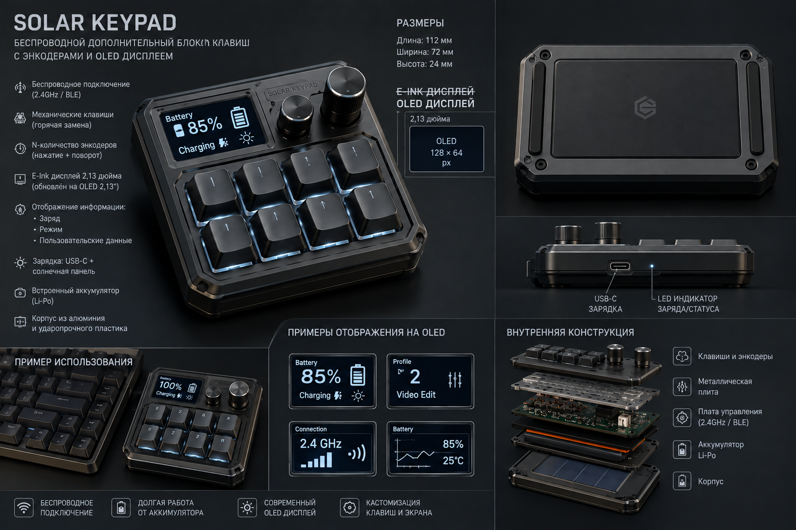
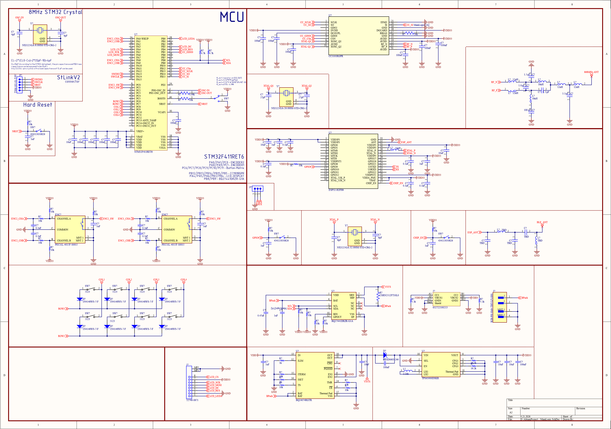

[🇷🇺 Русский](README.md) · [🇬🇧 English](README.en.md)

# ⌨️ KeyPad

### Hardware macropad with wireless control logic

  
  
  

  
  
  
  

<strong>Schematic · PCB · firmware · 3D model</strong>

---

## ✨ About the project

**KeyPad** is a compact additional keyboard block / macropad project. The repository is intended for developing the hardware part of the device, including the electrical schematic, PCB, firmware and 3D model of the enclosure.

The project is based on wireless control logic and is intended for further development and experimental assembly.

The project is currently under development. The device concept and electrical schematic may represent different design stages and do not guarantee the final configuration of the device.

## 🎨 Device concept

  

> The image above is a visual concept and is not a photograph of a finished product or a guarantee of its final appearance.

## 📚 Documentation and schematics

### Main documentation

- **[MainLogic.pdf](MainLogic.pdf)** — exported PDF of the main electrical schematic.

### Schematic preview

  

## 🚦 Project status

| Section | Status |
|:--|:--:|
| 🧩 **Schematic** | ✅ Available in the repository |
| 🟩 **PCB** | ❌ Not available |
| 💾 **Firmware** | ❌ Not available |
| 🧊 **3D model** | ❌ Not available |

## 🛠️ How to open the project

1. Install **Altium Designer**.
2. Open the `KeyPad.PrjPcb` file.
3. Use `MainLogic.SchDoc` to work with the main schematic.
4. Open `MainLogic.pdf` to view the electrical documentation.

## 🔧 Development

The project can be used as a foundation for further hardware development, PCB preparation, firmware development and enclosure design.

Before manufacturing, it is recommended to perform a complete review of the schematic, power circuits, radio-frequency section, component footprints and compliance of the selected components with the project requirements.

## ⚠️ Important notes

- Firmware and software source code are not included in the repository.
- The presence of individual engineering files does not mean that the project is confirmed to be production-ready.
- The final BOM, electrical parameters and component compatibility must be checked directly before manufacturing.
- The concept, schematic and future mechanical design may change independently of one another.
- Additional verification of the electrical schematic and all engineering documentation is recommended before manufacturing.

---

### 🚀 KeyPad · hardware development project

**Stage: engineering development and documentation**

