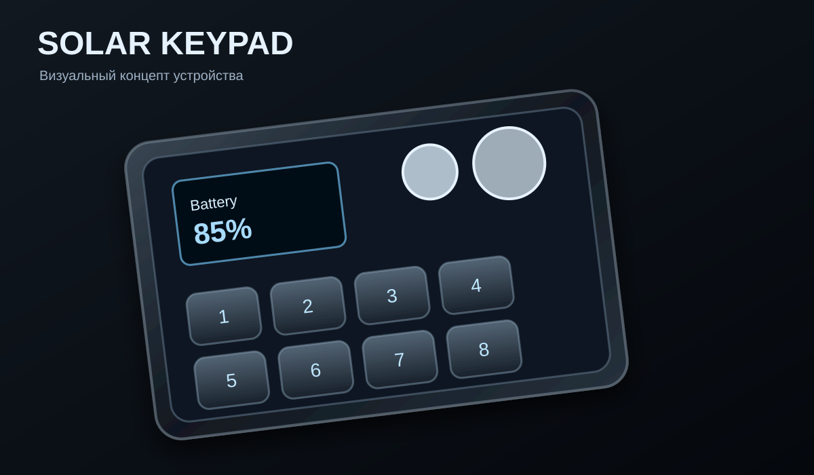

# KeyPad

Проект аппаратного макропада/клавиатурного блока, разработанный в формате инженерных исходников Altium Designer. Репозиторий содержит схему основного логического блока, библиотечные компоненты, экспортированные PDF-документы и артефакты проектирования.

## Что это за проект

KeyPad — это аппаратный проект компактного клавиатурного модуля с логикой управления, рассчитанный на разработку и документирование схемы в Altium Designer. В настоящий момент репозиторий содержит инженерную структуру проекта, схемы, библиотеки компонентов и экспортированную документацию, но не содержит законченной прошивки, исходного кода ПО и готовой производственной документации.

> Важно: концепт-изображение и электрическая схема могут находиться на разных стадиях разработки; окончательные параметры, комплектация и реализация должны подтверждаться по исходным схемным данным проекта.

## Концепт

## Документация и схемы

- [Открыть KeyPad.pdf](KeyPad.pdf)

- [Открыть MainLogic.pdf](MainLogic.pdf)

## Как открыть проект

1. Установить Altium Designer.
2. Открыть файл `KeyPad.PrjPcb`.
3. При необходимости открыть `MainLogic.SchDoc` для работы со схемой.
4. Для просмотра документации использовать PDF-файлы: `MainLogic.pdf` и `KeyPad.pdf`.

## Статус проекта

| Элемент | Статус |
| --- | --- |
| Схема проекта | Есть в репозитории |
| Аналог печатной платы / PCB-структура | Есть в репозитории |
| PDF-экспорт схем | Есть в репозитории |
| Прошивка / firmware | Не представлена |
| Исходный код ПО | Не представлен |
| Производственная готовность | Не подтверждена |

## Ограничения и замечания

- Репозиторий содержит инженерные исходники и документацию, но не включает готовый программный стек.
- Внутри проекта присутствуют сторонние или подключенные библиотеки компонентов, их актуальность и соответствие конкретной сборке следует проверять по исходным файлам проекта.
- Точный состав BOM и технические параметры сборки должны подтверждаться по схеме и библиотекам, а не по общему описанию в README.

## Контакты и заметки

Этот проект представлен как инженерная наработка в открытом репозитории. Для дальнейшего использования, доработки и выбора комплектующих требуется проверка исходных схем и библиотек проекта.

---

Статус: проект находится в стадии инженерного описания и документирования в репозитории; производство и финальная сборка не подтверждены.
